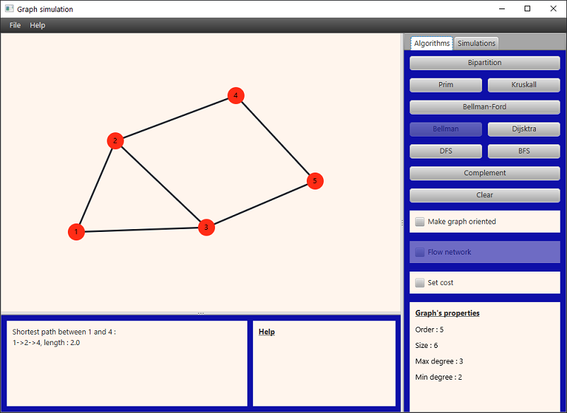

# Graph Visualizer

_Graph Visualizer_ is a graphical user interface that helps you create graphs and animate graph-related algorithms.
You're welcome to contribute to the project in any way you want, just submit your pull request.

## Getting started

Fork the repo and run these _maven_ commands:

`mvn compile`

`mvn javafx:run`

## TODO

You can find below a list of ideas and fixes to contribute to the project:

Fixes:

1. Center name of vertices
2. Improve visual
3. Separate algorithms' logic from their drawings
4. Add unitary tests
5. Add information about the algorithms speed slider

Extension:

1. Add more algorithms (https://en.wikipedia.org/wiki/Category:Graph_algorithms)
2. Add "Preferences" tab to the menu bar that allows user to customize the color/shapes used in the graph panel
3. Mention the complexity of the algorithms
4. Construct an API to use graph structure and algorithms (without their drawings)
5. Add extension to the _Zombie Epidemic_ simulation:
    * make the epidemic spread only to one random neighbor for every infected vertex
    * add a population to each vertex (the new goal would be to minimize the infected population)
    * multiple outbreaks